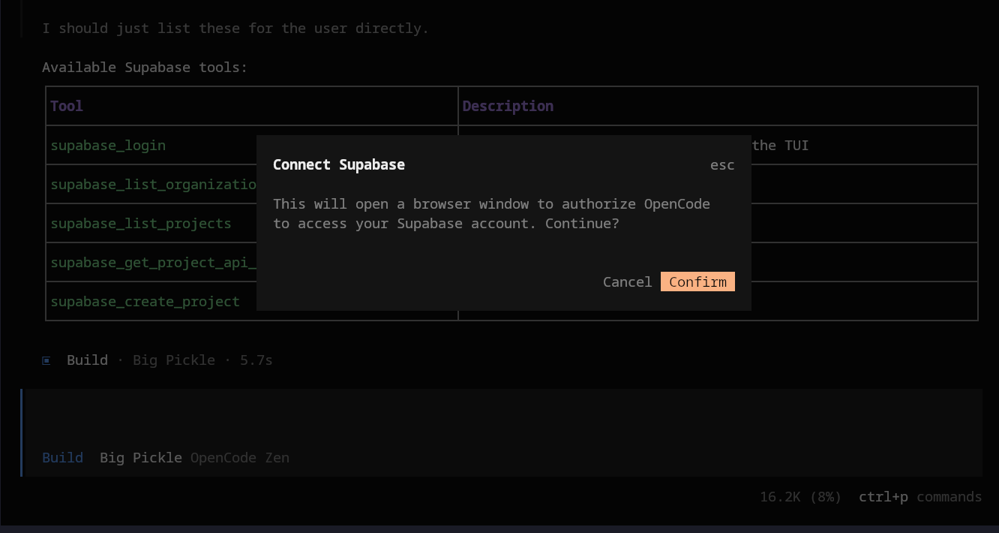

# opencode-supabase

[](https://supabase.com/)



OpenCode plugin for Supabase workflows, with OAuth wiring through a broker plus separate server and TUI entrypoints.

## Install

Requires OpenCode `>= 1.3.4`.

```bash
opencode plugin opencode-supabase
```

Then:

1. run `/supabase`
2. ask your agent what Supabase-related capabilities are available

## What You Can Use

- run `/supabase` to connect your Supabase account in the TUI
- ask your agent to list organizations or projects
- ask your agent to get project API keys
- ask your agent to create a new Supabase project

Current tool surface:

- `supabase_list_organizations`
- `supabase_list_projects`
- `supabase_get_project_api_keys`
- `supabase_create_project`
- `supabase_login`

Under the hood, the plugin handles browser auth, the local callback flow, and token exchange through a broker.

## Development

Install dependencies:

```bash
bun install
```

Run checks:

```bash
bun run typecheck
bun test
```

For local broker setup and end-to-end auth testing, see `TESTING.md`.

## Advanced Install

If you are working from a local checkout instead of the published plugin name, use an absolute path:

```bash
opencode plugin /absolute/path/to/opencode-supabase
```

Sibling checkout example:

```bash
opencode plugin ../../opencode-supabase
```

If you wire config manually, set the plugin in both files because server and TUI plugins load separately.

`.opencode/opencode.jsonc`

```json
{
  "plugin": ["/absolute/path/to/opencode-supabase"]
}
```

`.opencode/tui.jsonc`

```json
{
  "plugin": ["/absolute/path/to/opencode-supabase"]
}
```

Relative plugin paths are resolved from inside `.opencode/`, not from the consumer repo root.

## Reference

- Supabase Management API: https://supabase.com/docs/reference/api/introduction
